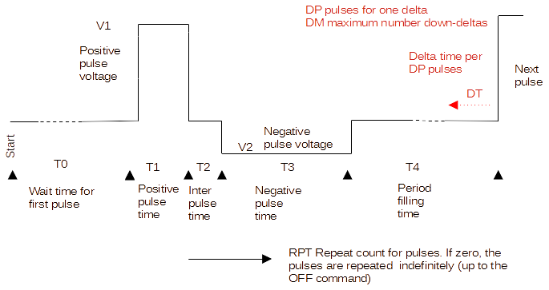

# MilliPillar3

This is a further development of the software/firmware for MilliPillar V2

It contains new hardware including meaasuring current and voltages.

The firmware, and controlsoftware are further developments on V2; therefore the following contains more or less the text of V2:

### Introduction
-------

The [miliPillar platform](https://pubs.acs.org/doi/10.1021/acsbiomaterials.1c01006) contains a stimulator based on the
Arduino Uno/Nano development board. The software for that system is at the moment inflexible and static. It can not produce
all types of stimuli as described in Electrical-stimulation-of-excitable-tissue-design-of-efficacious-and-safe-protocols.pdf.

This project contains the source for a more universal firmware on the same hardware, which can change the stimulus waveform
and repetition rate on the fly.

The definitions for the settings are given using the figure below.

The parameters are as follows:

| Parameter   | Description                                                       |
|-------------|-------------------------------------------------------------------|
| T0          | Time (in ms) before repeated pulses start after the 'RUn' command |
| T1          | Time (in units of 100us) of the positive going pulse                          |
| T2          | Time (in units of 100us) of  the interphase delay ( 0 means 'no interphase delay') |
| T3          | Time (in units of 100us) of the negative going pulse ( 0 means 'no negative pulse') |
| T4          | Time (in ms) to fill up a complete period (the maximum in case of decreasing periods) |
|  |    |
| V1    | Voltage (in units of 0.1Volt / 100 mV) for the positive pulse |
| V2    | Voltage (in units of 0.1Volt) for the negative pulse |
|  |    |
|  |    |

Note: all parameters are zero or positive integer numbers (No negative numbers).

NOTE 2:The support for a fixed number of pulses, and variable daily change of timing (other BPM settings) is dropped.
These things can be done through the GUI

### Control
-------

The parameter setting for the stimulator is controlled through the serial port on the Arduino Uno/Nano taking use of the onboard USB to serial converter.
On that interface a terminal is configured within the firmware. The terminal has a prompt showing `TERM> ` which invites the user towards
entering a command line.

The terminal has several commands to make optimal use of the stimulator. The terminal can of course also be controlled by a PC program
with graphical interface to enhance the user experience. This project does not include such a program.

The commands recognized by the stimulator are:

| Command and params | Description                                                       |
|--------------------|-------------------------------------------------------------------|
| `HE`               | Gives HElp output  |
| `VE`               | Gives VErsion information |
| `RU`      | Start giving pulses.  |
| `OF`      | Stop emitting pulses (OFf) |
| `GS`      | Get Status on/offs  |
| `SN`      | Show Serial Number  |
| `SS`               | ShowSettings; shows all current parameters |
|`RE`        | Recording on |
|`NR`        | No Recording  |
| `SV <0..50>,<0..50>` | SetVoltages. The second parameter is for V1, the third for V2 |
| `ST <0..65535>,..,<0..65535>` | SetTimes for a channel. The second parameter is T0, third T1, and up to sixth for T4 |
| `SC  <0..65535>..` | Set Calibration (To be implemented)  |
| `WR`               | Write (store) all settings to EEPROM, including the start-flags. On power up these settings are read from EEPROM. |
| `EO` | Echo  off. Comfortable for a GUI   | 
|      |   |
 
Notes:
 - All parameters must be given
 - No spaces allowed around the commas
 - Values are given in decimal positive form
 - `<0..65535>` means a value has to be given between (and included) 0 and 65535
 - brackets mean "optional"
 - On the line, after the command, additional comments can be given if separated by a blank (space comma etc). This allows
 for writing a script with comments for your serial terminal program.
 - A command can be edited while entered and will be executed when the 'enter'-key is pressed (sending a CR on the line)
 - Empty commands do nothing, illegal or wrongly composed commands are responded on with a short explanation
 
### Additional
-----------

Use a terminal program at the PC side. For Windows there are 'PuTTY', 'TeraTerm', and many more. 
Set the serial port to '38400 baud, 8 bits, No parity, 1 stopbit'.

Note for PuTTY:
 - Take care to set in menu *Change settings... --> Terminal --> Keyboard --> The Backspace key* to *Control-H*.

There is a functional GUI
  
Additional descriptions can be found in the `docs`
  
The firmware, written in C, can be found in `src`. It is written and compiled within the Microchip Studio 7.0 IDE, for more 
portability and a flexable environment.
The resulting .hex and .elf files (in the `src/Release` map) can be downloaded to the Arduino using the Arduino IDE.
  
In case you want to compile and/or change the firmware yourself, you need for this project Microchip Studio 7.0. 
Downloadable from https://www.microchip.com/en-us/tools-resources/develop/microchip-studio#Downloads

  
### How to upload hex-file to Arduino
----------------------------------

There are several good descriptions on the web:

- https://arduino.stackexchange.com/questions/60599/how-can-i-upload-a-hex-file-to-an-arduino-uno
- https://forum.arduino.cc/t/the-simplest-way-to-upload-a-compiled-hex-file-without-the-ide/401996
- https://www.aranacorp.com/en/generating-and-uploading-hex-files-to-an-arduino/

__NOTE: The Gui can do that now!__

### Hardware
------------

Some changes made to the sketch of august/september 2025. May contain a normal Arduino Nano, or a ATmega328P. The firmware
is not fit for the Nano Every!

### Python GUI
--------------

Contains the full support for all functions of the stimulator, and is able to load and upgrade the firmware.

Should work on Linux, Mac and Windows; tested on Windows including an executable for users.

### Current dev
-----------

All necessary functions to be able to use the system are present and working.
To do:
- The calibration of the measurement circuits is not implemented yet
- The recording is not implemented yet (The button and LED are functioning)

## Starting:
------------

On Windows. Get a normal Arduino Nano, or a clone. (No 'Every'!)
- Download the MilliPillar3.exe from `gui\src\dist\MilliPillar3.exe`
- Download the MilliPillar3.hex `firmware\src\Release\MilliPillar3.hex`
- Connect The Arduino to the PC and start MilliPillar3.exe
- On the AdministrationView tab check the correct port is selected (should have been selected automatically)
- At 'Firmware upgrade' select / browse to the downloaded hex file
- Flash it. You should see progress messages at the statusbar (bottom line)

- Ready

- Your UserView can now be used

### Tooling and other notes
---------------------------
The hardware is developed with KiCAD design software. For reference the schematic is also given as pdf document. 
The firmware is written using the Microchip Studio 7.0 environment. You can get it through the URL [https://www.microchip.com/en-us/tools-resources](https://www.microchip.com/en-us/tools-resources/develop/microchip-studio#Downloads); older Atmel versions will work as well. 
The firmware is written for ATMega328p, with rewriting timer.c, board.c and serial.c it can be adapted for the ArduinoNano Every (with mcu ATmegaATmega4809).
The PC software is fully based o Python. Version 3.12 was used during development, any version in the 3-series should be fine. 
The requirements.txt contains the names of the needed packages to conveniently install them using 'pip'. For users who want to 
adapt/develop the software to their likings, it is advised to install QT Designer as well.

